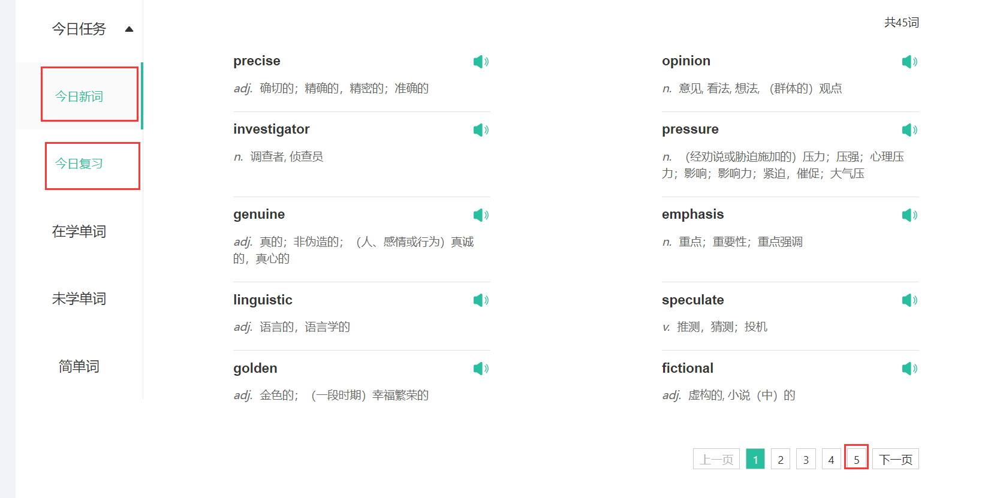

# 使用说明

- 首先需要在`config.py`文件中填写一些信息。需要登录在PC端登陆扇贝，然后把`cookie`复制一下，今日所学单词的总页数`NEW_PAGE_NUM`和复习单词`REIVEW_PAGE_NUM`的总页数。



- 运行代码

在当前目录打开命令行输入以下的指令

```python
python shellbays.py
```

等待一段时间就会在当前目录出现一个以`当前日期`命名的txt文件，这里面就是今天所学的单词和所复习的单词。

# prompt

I want you to act as a The Economist journal editor.  I'll give you some words at the end.  You have to use these words to make an English essay in at least 400 words, and you have to use all the words. The words I give in the passage need to be italicized and bolded.  A Chinese translation should be included at the end of the passage.  This is the word:“XXX”

示例

- 用户

I want you to act as a The Economist journal editor. I'll give you some words at the end. You have to use these words to make an English essay in at least 400 words , and you have to use all the words. The words I give in the passage need to be italicized and bolded. A Chinese translation should be included at the end of the passage. This is the word:“stare, responsible, confuse, synthesize, truly, measurement, duplicate, beginning, blank, reside, mobilize, intelligence, confront, correlation, distract, precise, opinion, investigator, pressure, genuine, emphasis, linguistic, speculate, golden, fictional, ending, internal, pattern, beloved, fantasy, medication, tutor, desperate, temporarily, pizza, actual, universal, distance, expel, observe, lens, equal, arrange, dislike, tradition, hint, reject, plot, series, kingdom, juvenile, liberate, devote, grieve, explore, plug, literally, outcome, learning, connection, ”

- 回答

The Modern Measurement of Intelligence In today's world, there are many ways to **measure** a person's **intelligence**. Traditionally, **intelligence** was assessed primarily through **linguistic** and logical reasoning tests that focused on words, numbers and **patterns**. However, our understanding of **intelligence** has evolved to include a much wider range of cognitive abilities. Modern **intelligence** tests now also incorporate measures of creative thinking, emotional **intelligence**, visual-spatial skills and more. When psychologists first began to **speculate** about **intelligence**, they focused on verbal and logical reasoning abilities that were emphasised in traditional education. Early **intelligence** tests reflected these **traditional** views, **measuring** verbal **fluency**, logical reasoning and **pattern** recognition using paper-and-pencil tests with a strong verbal and numerical focus. While these tests captured some important aspects of **cognition**, they failed to provide a **complete** and **accurate** **measurement** of all the facets of human **intelligence**. Today, the science of **intelligence** recognizes that it is much broader in scope. Modern **theories** recognize the importance of creative thinking, emotional skills, visual-spatial abilities, and more. Correspondingly, modern **intelligence** tests have incorporated new types of **measurements** to gain a more comprehensive understanding of a person’s cognitive abilities. For example, tests may now include sections on abstract logical reasoning, quick decision making, visual **pattern** recognition, innovative problem solving, emotional problem solving, and so on. A person’s **intelligence** profile is highly complex and multi-dimensional. There are as many expressions of **intelligence** as there are individuals. While **standardized** tests can provide useful information, we must remember that human **cognition** cannot be reduced to a single number or score. True **intelligence** is diverse, dynamic and highly personal. Modern **approaches** that recognize this complex, multi-faceted nature are moving us closer to understanding and appreciating the richness of human **intelligence** in all its forms. Overall, the modern **measurement** of intelligence has become more comprehensive, creative, and cognizant of this inner diversity. 

现代智力测量在当今世界,有许多方法可以**测量**一个人的**智力**。传统上,**智力**主要通过**语言**和逻辑推理测试来评估,这些测试侧重于单词、数字和**模式**。然而,我们对**智力**的理解已经发展到包括更广泛的认知能力。现代**智力**测试现在也结合了对创造性思维、情感**智力**、视觉空间技能等的测量。当心理学家首次开始**猜想**关于**智力**时,他们关注于传统教育中强调的口语和逻辑推理能力。早期的**智力**测试反映了这些**传统**观点,通过考察口语**流畅度**、逻辑推理和**模式**识别来**测量**,这些测试采用笔试形式,口语和数字方面占很大比重。虽然这些测试捕捉了一些重要的**认知**方面,但未能提供人类**智力**各个方面的**完整**和**准确**的**测量**。今天,**智力**科学认识到其范围更广泛。现代**理论**认识到创造性思维、情感技能、视觉空间能力等的重要性。相应地,现代**智力**测试也结合了新类型的**测量**,以更全面地理解一个人的认知能力。例如,测试现在可能包括抽象逻辑推理、快速决策、视觉**模式**识别、创新问题解决、情感问题解决等部分。一个人的**智力**轮廓是极其复杂和多维的。表达**智力**的方式与个人一样多。虽然**标准化**测试可以提供有用信息,但我们必须记住, 