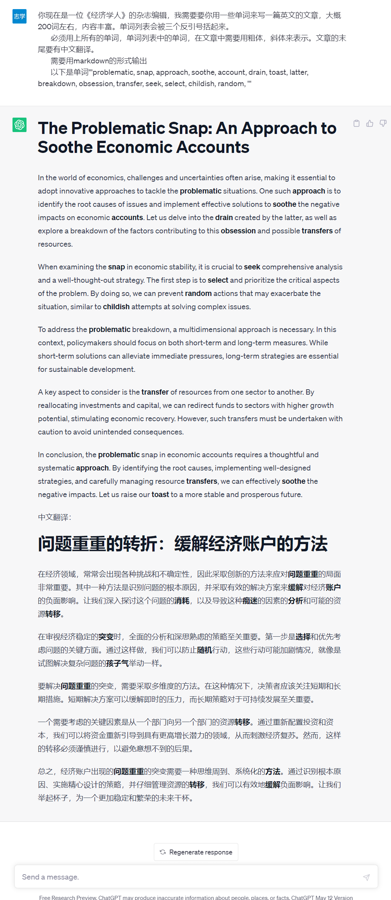

# 使用说明

- 首先需要在`config.py`文件中填写一些信息。需要登录在PC端登陆扇贝，然后把`cookie`复制一下，今日所学单词的总页数`NEW_PAGE_NUM`和复习单词`REIVEW_PAGE_NUM`的总页数。


- 运行代码

在当前目录打开命令行输入以下的指令

```python
python shellbays.py
```

等待一段时间就会在当前目录出现一个以`当前日期`命名的txt文件，这里面就是今天所学的单词和所复习的单词。

由于我终于有了`chatgpt`的账号，所以更新一波`prompt`。`prompt`会直接在生成的txt文件末尾，只需要复制即可。

## prompt

你现在是一位《经济学人》的杂志编辑，我需要要你用一些单词来写一篇英文的文章，大概200词左右，内容丰富。单词列表会被三个反引号括起来。
        必须用上所有的单词，单词列表中的单词，在文章中需要用粗体，斜体来表示。文章的末尾要有中文翻译。
        需要用markdown的形式输出
        以下是单词'''problematic, snap, approach, soothe, account, drain, toast, latter, breakdown, obsession, transfer, seek, select, childish, random, '''

## 效果如下

